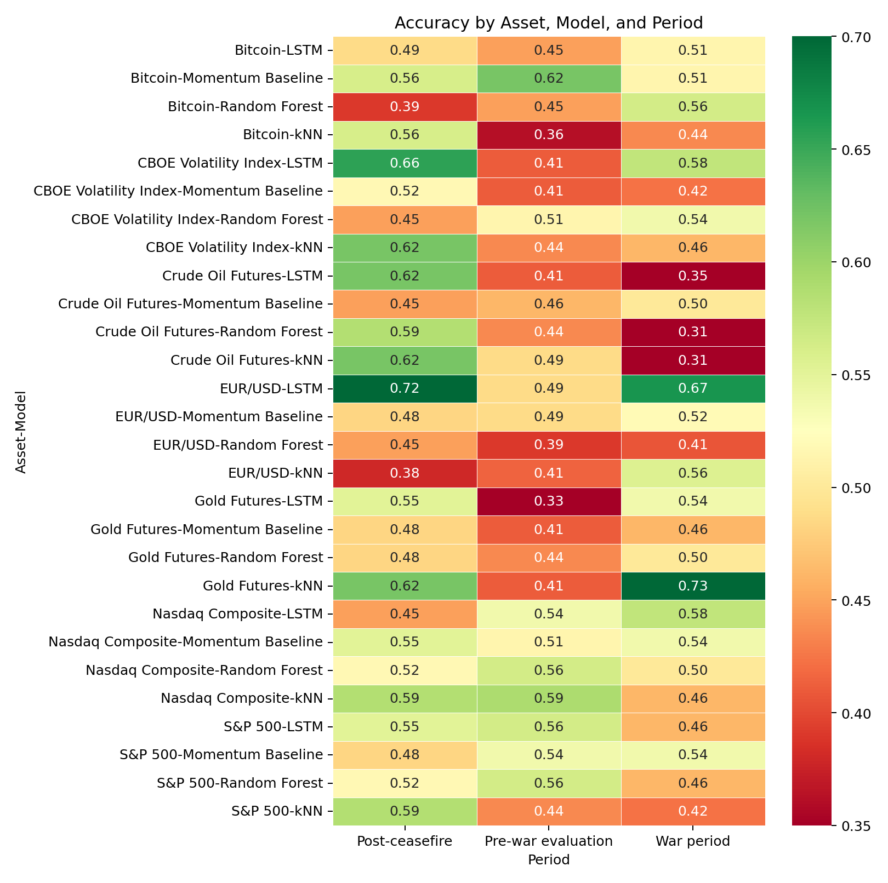
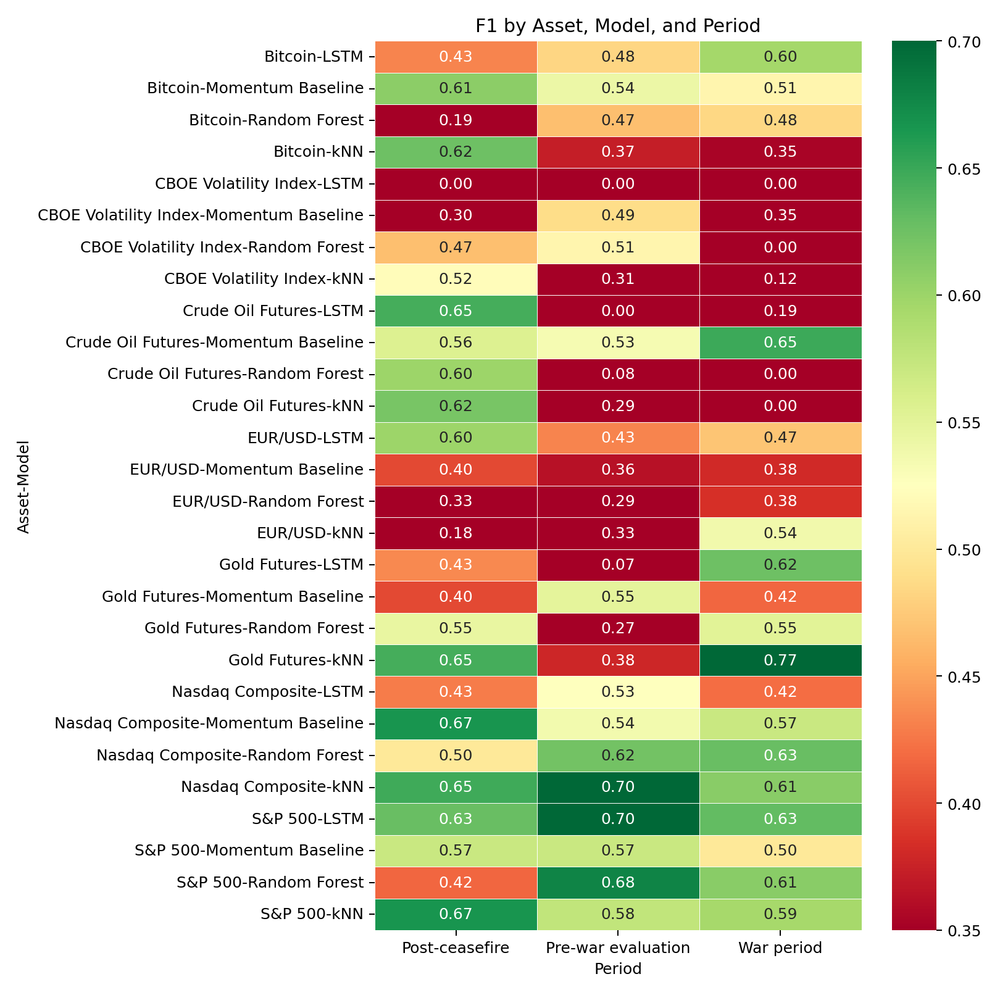

# Financial Market Direction Prediction During the US-Iran Conflict

This project was prepared as a university machine learning assignment and portfolio project. It compares k-NN, Random Forest, and LSTM models for predicting next-day financial market direction with up-to-date Yahoo Finance data.

The main research question is:

> Do models trained on earlier market data keep their predictive performance during the US-Iran war period and the post-ceasefire period?

## Event Windows

The project uses event-based periods around the 2026 US-Iran conflict:

| Period | Date Range | Purpose |
|---|---:|---|
| Training | 2024-01-01 to 2025-12-31 | Learn from earlier market behavior |
| Pre-war evaluation | 2026-01-01 to 2026-02-27 | Test shortly before the conflict |
| War period | 2026-02-28 to 2026-04-07 | Test during the conflict |
| Post-ceasefire | 2026-04-08 to 2026-05-19 | Test after the ceasefire announcement |

Event-date context is based on public reporting and briefings, including Al Jazeera's conflict timeline, Axios' ceasefire report, and the UK House of Commons Library briefing.

## Assets

| Ticker | Asset |
|---|---|
| `CL=F` | Crude Oil Futures |
| `GC=F` | Gold Futures |
| `^GSPC` | S&P 500 |
| `^IXIC` | Nasdaq Composite |
| `^VIX` | CBOE Volatility Index |
| `BTC-USD` | Bitcoin |
| `EURUSD=X` | EUR/USD |

## Methodology

The target variable is binary:

```text
1 = tomorrow's close is higher than today's close
0 = tomorrow's close is lower or equal
```

The feature set includes daily returns, moving-average ratios, rolling volatility, RSI, MACD, volume change, and previous-day direction.

The project uses time-aware evaluation. Models are trained on historical observations ending on `2025-12-31` and then tested on later periods. This avoids random train-test splitting, which would leak future information in a financial time-series problem.

The goal is not to build a trading bot. The focus is to practice a complete machine learning workflow: data collection, feature engineering, model comparison, time-based evaluation, visualization, and interpretation of results.

## Models

- k-Nearest Neighbors
- Random Forest
- LSTM neural network
- Momentum baseline

## Current Results Snapshot

The latest run generated 4,329 engineered observations and 84 model evaluation rows. Average performance remains close to the 50% baseline, which is realistic for noisy daily direction prediction. The strongest period-level results were:

| Period | Best Asset / Model by F1 | Accuracy | F1 | Interpretation |
|---|---|---:|---:|---|
| Pre-war evaluation | Nasdaq Composite / kNN | 0.590 | 0.704 | Equity-index direction had strong short-window recall before the conflict. |
| War period | Gold / kNN | 0.731 | 0.774 | Gold behaved more directionally during the stress period, consistent with safe-haven dynamics. |
| Post-ceasefire | S&P 500 / kNN | 0.586 | 0.667 | Equity markets showed some short-window rebound structure, but the period is still short. |

See [`reports/final_report.md`](reports/final_report.md) and [`reports/results/metrics.csv`](reports/results/metrics.csv) for full results.

## Figures





## How to Run

Create and activate a virtual environment, then install dependencies:

```powershell
python -m venv .venv
.\.venv\Scripts\Activate.ps1
pip install -r requirements.txt
```

Run the full project:

```powershell
python run_project.py
```

Generated outputs:

```text
data/raw/              downloaded Yahoo Finance data
data/processed/        engineered feature table
reports/results/       model metrics
reports/figures/       plots and heatmaps
reports/final_report.md
```

## Notes

This project is for academic analysis and portfolio demonstration only. It is not financial advice and should not be interpreted as a trading system.

## Event Context Sources

- [Al Jazeera: US and Israel bomb Iran timeline](https://www.aljazeera.com/news/2026/2/28/us-israel-bomb-iran-a-timeline-of-talks-and-threats-leading-up-to-attacks)
- [Axios: US and Iran agree to two-week ceasefire](https://www.axios.com/2026/04/07/iran-2-week-ceasfire-trump-pakistan)
- [UK House of Commons Library briefing](https://commonslibrary.parliament.uk/research-briefings/cbp-10637/)
